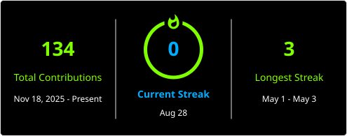

<!-- Header Matrix Rain Effect via SVG -->
<div align="center">

<!-- Glitch Title -->


```text
 ██████╗██╗███╗   ██╗██████╗ ██████╗ ██╗██╗  ██╗
██╔════╝██║████╗  ██║██╔══██╗██╔══██╗██║╚██╗██╔╝
██║     ██║██╔██╗ ██║██║  ██║██████╔╝██║ ╚███╔╝ 
██║     ██║██║╚██╗██║██║  ██║██╔══██╗██║ ██╔██╗ 
╚██████╗██║██║ ╚████║██████╔╝██║  ██║██║██╔╝ ██╗
 ╚═════╝╚═╝╚═╝  ╚═══╝╚═════╝ ╚═╝  ╚═╝╚═╝╚═╝  ╚═╝
```


<br/>


</div>

---

<!-- Terminal Bio -->
<div align="center">

```bash
┌──(Cindrix㉿air-university)-[~]
└─$ cat about_me.txt

  > Alias    : Cindrix
  > Identity : [REDACTED]
  > Uni      : Air University, Pakistan
  > Degree   : BS Cybersecurity [3rd Semester]
  > Role     : Aspiring SOC Analyst | Blue Teamer
  > CGPA     : 3.15 / 4.0  [Semester II]
  > Mission  : Detect. Analyze. Respond. Repeat.
  > Status   : [ ████████░░ ] Building skills...

┌──(Cindrix㉿air-university)-[~]
└─$ █
```

</div>

---

<!-- Dynamic Skills -->
## ⚡ `./skills --list`

<div align="center">


<br/><br/>

<!-- Badges -->


</div>

---

<!-- Dynamic Projects -->
## 🚀 `./projects --active`

<div align="center">


</div>

<br/>

```
┌──(Cindrix㉿air-university)-[~/projects]
└─$ ls -la

  [01] ssh-bruteforce-splunk       [ IN PROGRESS ██░░░░░░░░ 20% ]
  [02] port-scan-detection-lab     [ QUEUED      ░░░░░░░░░░  0% ]
  [03] reverse-shell-detection     [ QUEUED      ░░░░░░░░░░  0% ]
  [04] soc-investigation-sim       [ QUEUED      ░░░░░░░░░░  0% ]
  [05] log-based-ids-script        [ QUEUED      ░░░░░░░░░░  0% ]
  [06] beaconing-traffic-lab       [ QUEUED      ░░░░░░░░░░  0% ]
  [07] exploitation-visibility     [ QUEUED      ░░░░░░░░░░  0% ]
  [08] web-attack-siem             [ QUEUED      ░░░░░░░░░░  0% ]
  [09] network-baseline-report     [ QUEUED      ░░░░░░░░░░  0% ]
  [10] detection-rule-tuning       [ QUEUED      ░░░░░░░░░░  0% ]
```

---

<!-- Research Interests -->
## `./research --interests`

<div align="center">


</div>

---

<!-- GitHub Stats -->
## `./stats --github`

<div align="center">


<br/>

<a href="https://git.io/streak-stats"></a>

</div>

---

<!-- CTF & Certs -->
## `./ctf --status`

```bash
┌──(Cindrix㉿air-university)-[~/ctf]
└─$ cat progress.log

  Platform     : TryHackMe / HackTheBox
  Status       : [ Learning Phase ]
  Focus Areas  : Web Exploitation, Forensics, Network, OSINT
  Next Goal    : Complete SOC Level 1 Path (THM)

  Certifications in Queue:
  [ ] CompTIA Security+
  [ ] Google Cybersecurity Certificate
  [ ] Splunk Core Certified User
```

---

<!-- Contact -->
## `./contact --info`

<div align="center">


<br/>

```
  > "The quieter you become, the more you are able to hear." — Kali Linux motto
  > "Every breach leaves a cinder. I go looking for the smoke."
                                                        — Cindrix
```


</div>

---
<div align="center">
<sub>⚡ Built in the dark | Powered by caffeine & curiosity | Cindrix © 2026</sub>
</div>
